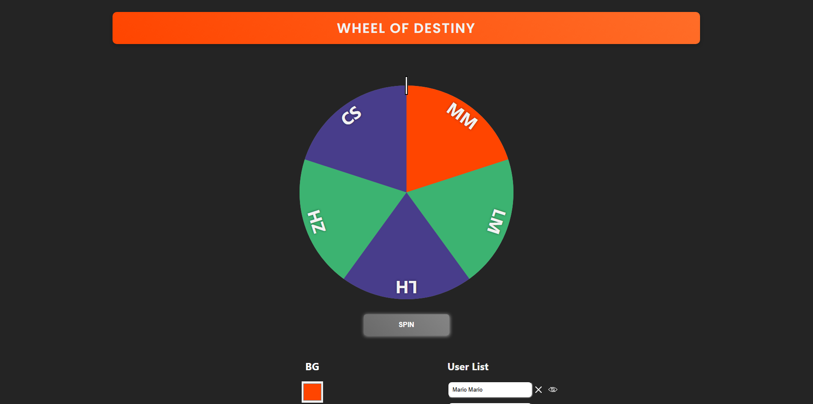

# Dungeon Crawler

## Table of Contents
* [Description](#description)
* [Installation](#installation)
* [Usage](#usage)
* [Questions](#questions)

## Description
An applicationt that enables users to randomly select from a list provided. Whose turn is it next? Find out with the Wheel of Destiny.

## Installation
After cloning the repository, cd into the generated directory. Run 'npm i' then start the application using 'npm run dev'.

## Usage
Modify the namesArray with your own list of names. You are also able to change the bgColor variables to change the colors of the wheel segments.

## Questions
Follow me on [Github](https://github.com/Kayvonk).

To contact me, send an email to kayvonk@gmail.com with your name and inquiry.