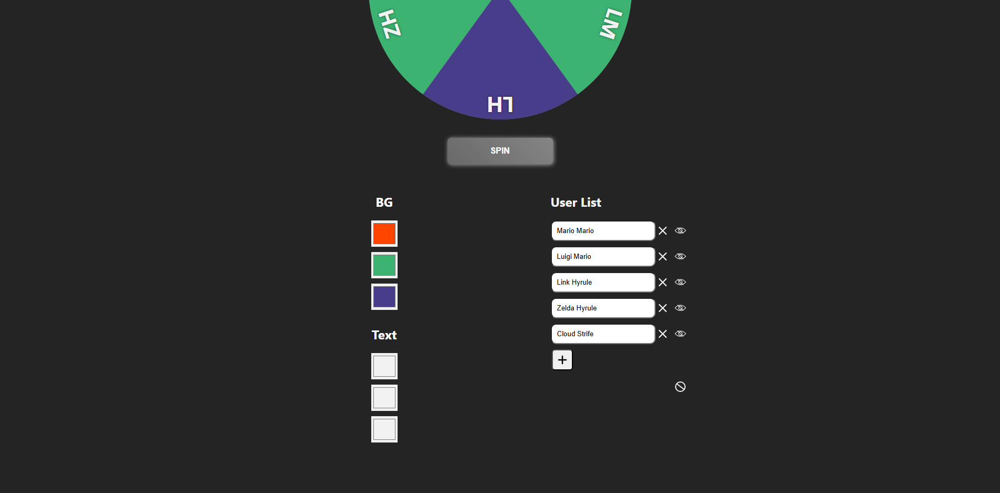
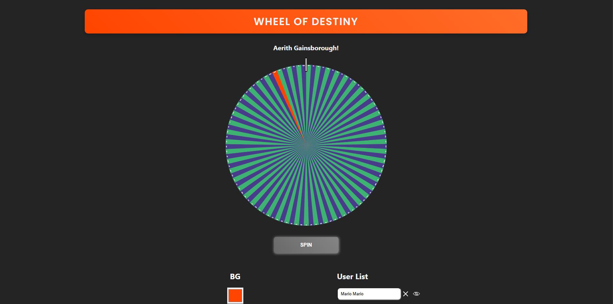

# Wheel of Destiny

## Table of Contents

- [Description](#description)
- [Installation](#installation)
- [Usage](#usage)
- [Questions](#questions)

## Description

An application that enables users to randomly select from a provided list. Whose turn is it next? Find out with the Wheel of Destiny.

## Installation

After cloning the repository, cd into the generated directory. Run 'npm i' then start the application using 'npm run dev'.

## Usage

Modify the namesArray with your own list of names. You are also able to change both the background colors and the text colors of the heading and wheel segments. The first color option for the background color and text colors correspond to the header and the first segment of the wheel. The follow background colors and text colors correspond to the alternating colors of the wheel segments. Names can be added or removed from the user list. Names can also be hidden and unhidden. Lastly, names can be cleared completely.

If you'd like to modify the code directly, you can modify the colors in the getStoredColors function of the App.jsx. To modify the list of names, update the defaultNamesArray in the UserList component. If you have already changed a color or run the application then you will need to clear your local storage to see your changes take effect.

Enjoy!

## Questions

Follow me on [Github](https://github.com/Kayvonk).

To contact me, send an email to kayvonk@gmail.com with your name and inquiry.
